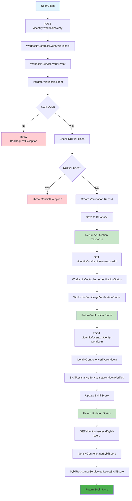
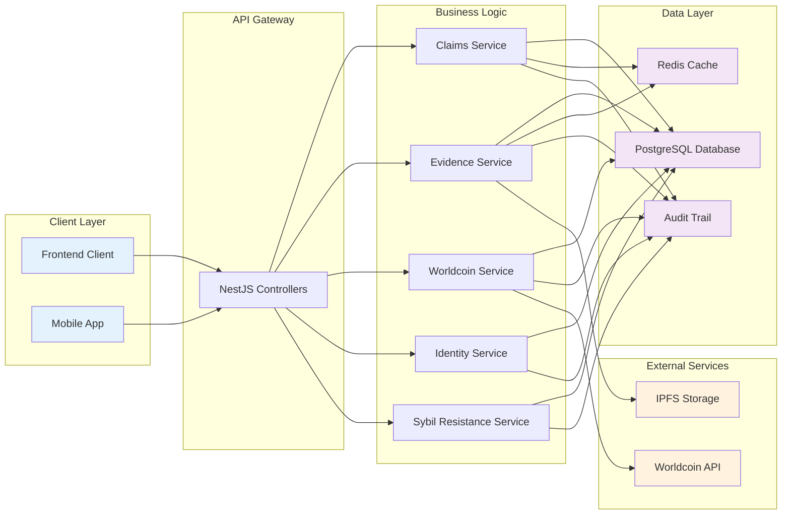
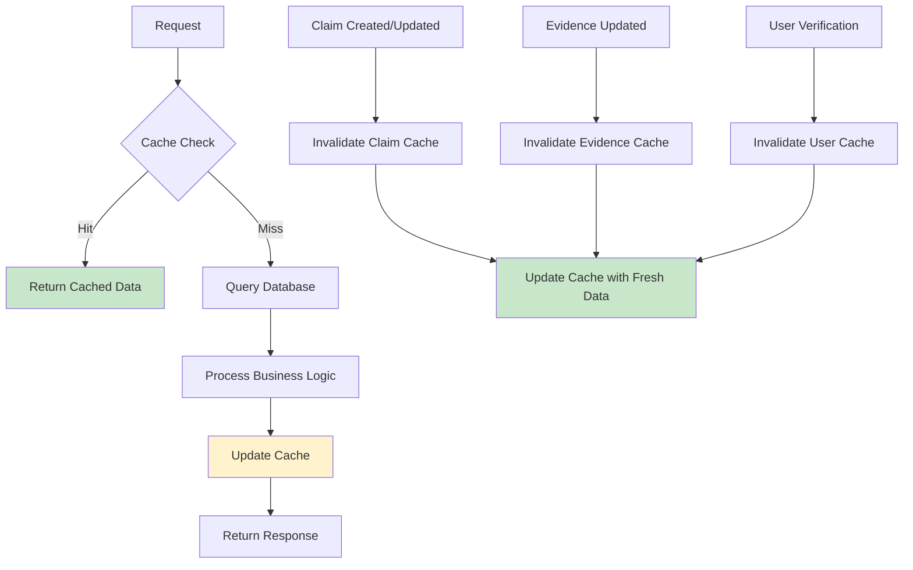
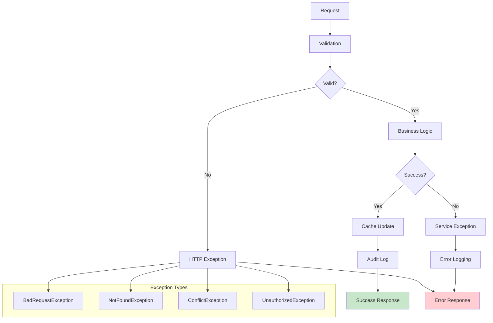

# Backend Workflow Diagrams

This document contains visual representations of the key backend workflows in the TruthBounty API system.

## Claim Flow

```mermaid
graph TD
    A[User/Client] --> B[POST /claims]
    B --> C[ClaimsController.createClaim]
    C --> D[ClaimsService.createClaim]
    D --> E[Generate mock verdict & confidence]
    E --> F[Save Claim to Database]
    F --> G[Cache Claim]
    G --> H[Audit Log: CLAIM_CREATED]
    H --> I[Return Claim Response]
    
    I --> J[POST /claims/:claimId/evidence]
    J --> K[ClaimsController.createEvidence]
    K --> L[EvidenceService.createEvidence]
    L --> M[Create Evidence Record]
    M --> N[Create Evidence Version v1]
    N --> O[Save to Database]
    O --> P[Audit Log: EVIDENCE_SUBMITTED]
    P --> Q[Return Evidence Response]
    
    Q --> R[PUT /claims/evidence/:evidenceId]
    R --> S[ClaimsController.updateEvidence]
    S --> T[EvidenceService.addEvidenceVersion]
    T --> U[Update Evidence latestVersion]
    U --> V[Create New Evidence Version]
    V --> W[Save to Database]
    W --> X[Audit Log: EVIDENCE_UPDATED]
    X --> Y[Return Updated Version]
    
    Y --> Z[ClaimsService.resolveClaim]
    Z --> AA[Update verdict & confidence]
    AA --> BB[Save Claim]
    BB --> CC[Cache Updated Claim]
    CC --> DD[Audit Log: CLAIM_RESOLVED]
    DD --> EE[Return Updated Claim]
    
    EE --> FF[ClaimsService.finalizeClaim]
    FF --> GG[Set finalized = true]
    GG --> HH[Save Claim]
    HH --> II[Cache Finalized Claim]
    II --> JJ[Audit Log: CLAIM_FINALIZED]
    JJ --> KK[Return Finalized Claim]
    
    style A fill:#e1f5fe
    style I fill:#c8e6c9
    style Q fill:#c8e6c9
    style Y fill:#c8e6c9
    style EE fill:#c8e6c9
    style KK fill:#4caf50
```



### Claim Flow Steps

1. **Claim Creation**
   - Client submits claim data via `POST /claims`
   - System generates mock verdict and confidence score
   - Claim is saved to database and cached
   - Audit trail records claim creation

2. **Evidence Submission**
   - Client adds evidence via `POST /claims/:claimId/evidence`
   - Evidence record created with version 1
   - Evidence version stored with CID reference
   - Audit trail records evidence submission

3. **Evidence Updates**
   - Client updates evidence via `PUT /claims/evidence/:evidenceId`
   - Version number incremented
   - New evidence version created
   - Audit trail records evidence update

4. **Claim Resolution**
   - System resolves claim with verdict and confidence
   - Claim updated in database and cache
   - Audit trail records resolution

5. **Claim Finalization**
   - System finalizes claim (sets finalized flag)
   - Claim updated in database and cache
   - Audit trail records finalization

## Verification Flow



### Verification Flow Steps

1. **Worldcoin Verification**
   - Client submits Worldcoin proof via `POST /identity/worldcoin/verify`
   - System validates proof with Worldcoin infrastructure
   - Checks for duplicate nullifier hash usage
   - Creates verification record if valid
   - Returns verification response

2. **Verification Status Check**
   - Client checks verification status via `GET /identity/worldcoin/status/:userId`
   - System retrieves latest verification for user
   - Returns verification status and details

3. **Sybil Score Update**
   - System updates user's Sybil resistance score via `POST /identity/users/:id/verify-worldcoin`
   - SybilResistanceService recalculates score based on verification
   - Returns updated status

4. **Sybil Score Retrieval**
   - Client retrieves current Sybil score via `GET /identity/users/:id/sybil-score`
   - System returns latest Sybil score for user

## Data Flow Architecture



## Cache Strategy



## Audit Trail Integration

```mermaid
graph TD
    A[User Action] --> B[Controller Method]
    B --> C[Service Method]
    C --> D[@AuditLog Decorator]
    D --> E[AuditTrailService.log]
    E --> F[Create Audit Entry]
    F --> G[Save to Audit Table]
    G --> H[Return to Service]
    H --> I[Complete Business Logic]
    I --> J[Return Response]
    
    subgraph "Audit Data Captured"
        K[Action Type]
        L[Entity Type]
        M[Entity ID]
        N[User ID]
        O[Description]
        P[Before State]
        Q[After State]
        R[Timestamp]
    end
    
    E --> K
    E --> L
    E --> M
    E --> N
    E --> O
    E --> P
    E --> Q
    E --> R
    
    style G fill:#e8f5e8
    style J fill:#e8f5e8
```

## Error Handling Flow



These diagrams provide a comprehensive overview of the backend workflows, data flow, and system architecture for the TruthBounty API. They can be used for:

- Developer onboarding and understanding
- System documentation
- Architecture discussions
- Troubleshooting and debugging
- Feature planning and development
